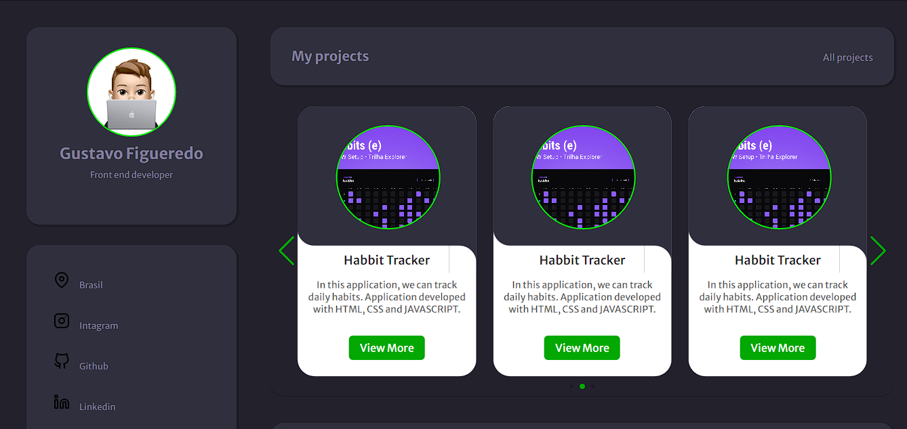

<h1 align="center"> Portfolio </h1>

Desenvolvida para que eu possa utilizar como uma forma de apresentar meu trabalho, projeto se encontra na primeira versão e poderá sofrer alterações.  

  <a href="#-tecnologias">Tecnologias</a>&nbsp;&nbsp;&nbsp;|&nbsp;&nbsp;&nbsp;
  <a href="#-projeto">Projeto</a>&nbsp;&nbsp;&nbsp;|&nbsp;&nbsp;&nbsp;
  <a href="#-layout">Layout</a>&nbsp;&nbsp;&nbsp;&nbsp;&nbsp;

 

  

## 🚀 Tecnologias

Esse projeto foi desenvolvido com as seguintes tecnologias:

- HTML e CSS
- JavaScript
- Git e Github
- Figma
- swiper

## 💻 Projeto

Este projeto foi desenvolvido para que eu possa utilizar como uma forma de apresentar meu trabalho, projeto se encontra na primeira versão e poderá sofrer alterações.

- [Acesse o projeto finalizado, online](https://gustafigueredo.github.io/Portfolio/)

## 🔖 Layout

Você pode visualizar o layout do projeto através [DESSE LINK](https://www.figma.com/file/L6fCiWtOgXCfslQdezqQeF/DD-Portfolio/duplicate). É necessário ter conta no [Figma](https://figma.com) para acessá-lo.

---

Feito por Gustavo Figueiredo.
